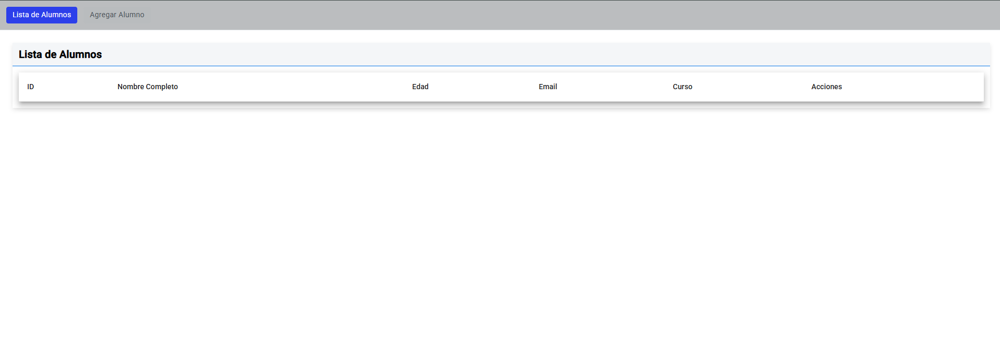
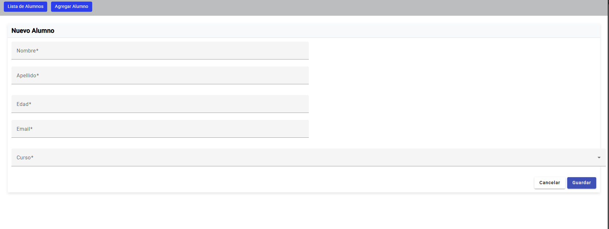
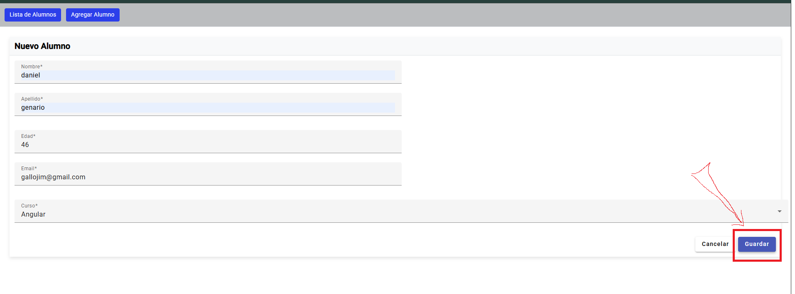
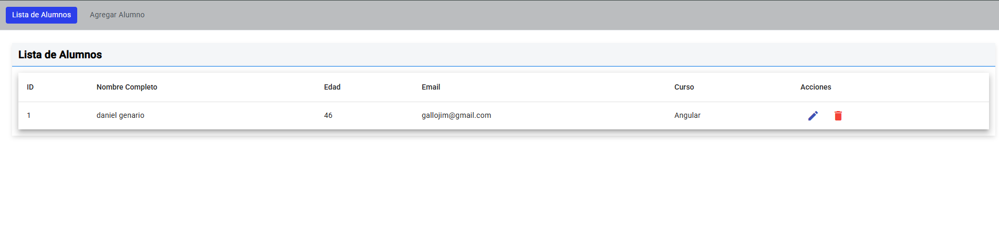
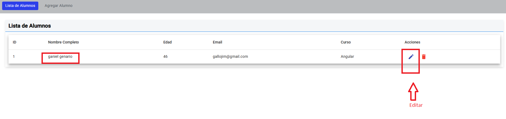
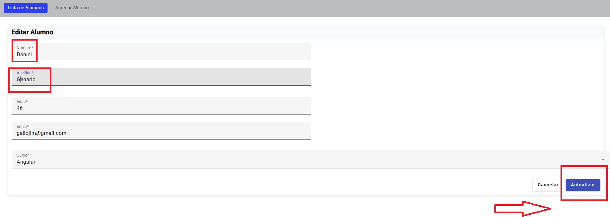
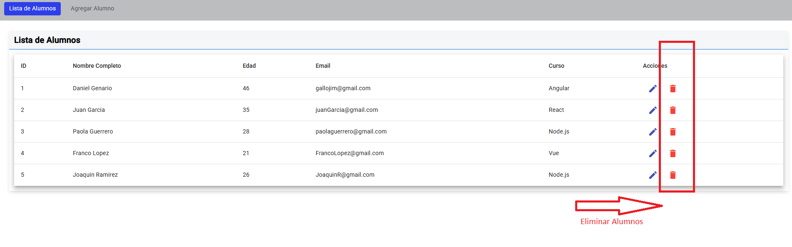
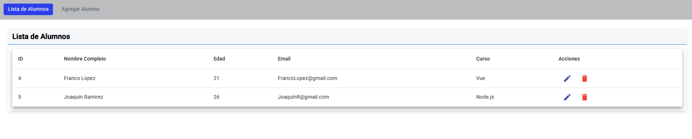

# 🎓 Gestión de Alumnos - Angular

Aplicación para administrar alumnos con tabla interactiva, formularios reactivos y pipes personalizados.

## 🚀 Características Principales

- **Tabla de alumnos** con Angular Material
- **Formulario reactivo** para ABM (Altas, Bajas y Modificaciones)
- **Pipes personalizados**:
  - `fullName`: Muestra nombre completo
  - `formatDate`: Formatea fechas
  - `age`: Calcula edad
- **Directiva personalizada** para estilos de títulos
- **Diseño responsive**

## 🛠️ Tecnologías Utilizadas

- Angular 18
- Angular Material
- Standalone Components
- Reactive Forms
- RxJS (BehaviorSubject)

## 📂 Estructura del Proyecto

src/app/
├── components/
│ ├── alumno-form/ # Formulario CRUD
│ └── alumno-lista/ # Tabla interactiva
├── directives/ # Directivas
├── models/ # Interfaces
├── pipes/ # Pipes
└── services/ # Lógica de datos

## 🔧 Instalación

1. Clonar repositorio
2. Instalar dependencias:
---------
npm install

Ejecutar aplicación con  ( ng serve )

Funcionalidades Clave
Tabla de Alumnos

Visualización en formato tabla
Ordenamiento y paginación
Acciones de edición/eliminación
Formulario Reactivo
Validación de campos
Manejo de fechas
Guardado/actualización de datos

Pipes Personalizados:

{{ alumno | fullName }} → "Juan Pérez"
{{ alumno.fechaNacimiento | age }} → "22 años"
{{ fecha | formatDate }} → "15/05/2023"

Ejemplo de flujo:

Formulario envía datos → Servicio actualiza estado → Tabla se actualiza automáticamente.
<!-- -------------------------------------------------------------------------------------------------- -->

## 📸 Capturas

